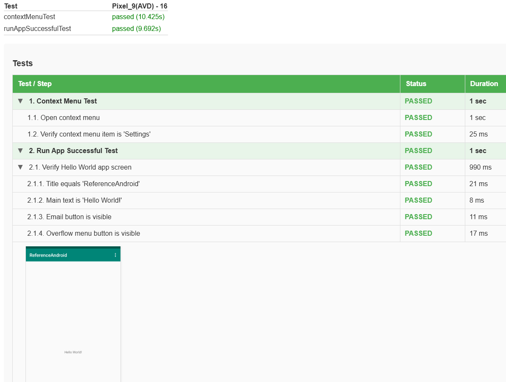
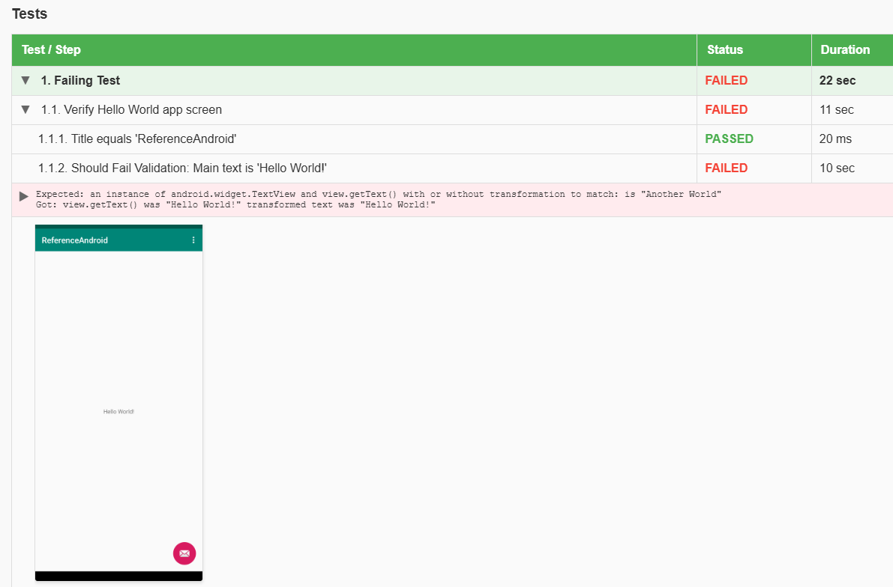

# Test assignment for Tikkie

## Author

* Applicant: Roman Iovlev
* Email: <romanyister@gmail.com>

## Application

### Technologies

* **Language**: Kotlin 2.2.0
* **Android SDK**: 34
* **UI Framework**: Material Design Components, AppCompat, ConstraintLayout
* **Build Tool**: Gradle/Android Gradle Plugin 8.13.2

### Screen and flows

* One screen application with simple header and "Hello World!" text in the middle, Email button and Context menu

## Testing

### Technologies

* **UI Testing Framework**: Kaspresso 1.5.3 (with auto-retry and advanced logging)
* **Page Object Pattern**: Kakao 3.7.0
* **Assertions**: Espresso Core 3.7.0
* **Test Runner Framework**: JUnit 4.13.2, Android
* **Report Generation**: Custom Kaspresso HTML Report with steps (buildSrc/src/main/groovy/TestReporter.groovy)

### Run tests in Android Studio

1. Run tests in Android Studio (you can use Green arrows near tests/gradle tasks or terminal)
2. Kaspresso HTML test report will build/run automatically after test run complete

### Run tests parallel

To run tests in parallel use gradle task `runTestsInParallel` or run in terminal `./gradlew.bat runTestsInParallel`

### Test project structure and best practices

* You can find test project in `java/com/abnamro/apps/referenceandroid/`
* Using Kakao PageObjects with Views(elements). Best approach for Android
* Using Kaspresso for tests to handle auto-retry(waits) and steps for best reporting
* Tests have steps for better visibility and reporting
* Custom reporting with structured hierarchy: Tests > Steps > (optional Substeps)
* Test data is not implemented as there are not much data to test in project

### Kaspresso test report

* Test report generated automatically after test run
* You can find test report here: `app\build\reports\androidTests\connected\debug\index.html`
* Test report include steps that can be expanded/collapsed
* In case of failure failed test have failed reason attached, stacktrace and screenshot
* It is possible to add screenshots to test reports for some steps to validate layout manually by human eyes later (using `screenStep`)

Note: Test report doesn't work well for now with parallel test run but that can be fixed later

### Testing strategy

Project is to small to demo any strategy so covered two flows

* Main screen with all elements
* Context menu with "Settings" element

## Next steps

### For Developers

* Include more functionality in project (check branch `tikkie-tests`)
* Add Unit Tests (Only example test exists) no real business logic covered with tests
* Track code coverage: SonarQube + JaCoCo (now Sonar commented out - not active)
* Add NFR testing: Accessibility, Performance and Security Testing
* While added API connectors, add mocks for Integration/API tests

### For QA

* Add mocks for used test data (while more functionality will be implemented + API layer)
* Add more functional tests using Balanced Test Pyramid principal
* Group tests by tags and categories/functionality
* Improve reporting. Add support for parallel test runs
* Implement AI Visual Assertions and add visual tests for basic layout validation for major screens
